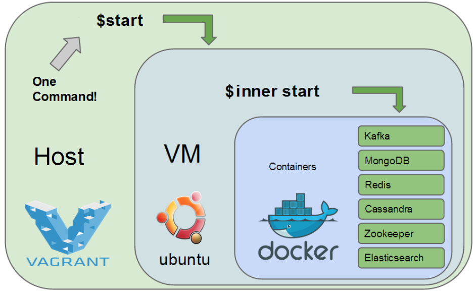

# Objective 
We want to have a development environment setup to be easy and automatic, regardless the operating system underneath being Windows / Linux / MacOS. 

The solution is through Docker + Vagrant

## Docker + Vagrant
 * Vagrant is just a Docker wrapper on systems that support Docker natively while it spins up a **host VM** (which I call *Container Host* )to run containers on systems that do not support it. User do not have to bother wether Docker is supported natively or not : the same configuration will work on every OS.
 * Docker hosts are not limited to a container (or a Virtualbox image of condensed Core Linux) but Debian, Ubuntu, CoreOS and other Linux distros are supported too. And can run can run on more stable VM managers than Virtualbox (e.g. VMWare).
 * Vagrant can orchestrate Docker containers: run multiple containers concurrently and link them together
 * The * Container Host * (libcontainer / Docker module) still requires Linux kernel 3.8 or higher and x86_64 architecture. This bounds considerably the environments Docker can natively run on.


Therefore, using Docker + Vagrant, we could build a project being
* Isolated: you don’t want to mess it up when testing some new tool or a different project.
* Repeatable: the same environment should be consistently reproducible on every team member machine and on CI and production servers.


 
# Vagrantfile

## ContainerHost
[Vagrantfile](https://github.com/mcfongtw/StudyNotesOnJavaPerformance/blob/master/examples/root/perf-container-base-builder/Vagrantfile) defines a custom Linux based vagrant box, which is pre-bulit and user can download from [Vagrant Cloud](https://app.vagrantup.com/mcfongtw/boxes/ubuntu-xenial-dbgsym). Here is the bash command to spin up this VM box:
```bash
$> vagrant box add mcfongtw/ubuntu-xenial-dbgsym --insecure
$> ....
$> vagrant up
```

The purpose of the container host is to provide a Linux based installed with [debug symbols](http://www.brendangregg.com/perf.html#Symbols)

Currently, we have Ubuntu Xenial boxes which can be downloaded at [https://url]

[DOCKER_HOST_NAME](https://github.com/mcfongtw/StudyNotesOnJavaPerformance/blob/master/examples/root/perf-container-base/Vagrantfile#L6) defines

## Application Container
For each application container, a Vagrantfile and an associated Dockerfile need to be defined.
Vagrant box supports Docker both as provider and reuses the same Vagrantfile as ContainerHost on different Docker containers to execute services as the following:
```ruby
VAGRANTFILE_API_VERSION = "2"
DOCKER_HOST_NAME = "ContainerHost"
DOCKER_HOST_VAGRANTFILE = "StudyNotesOnJavaPerformance/examples/root/perf-container-base/Vagrantfile"

Vagrant.configure(VAGRANTFILE_API_VERSION) do |config|

	config.vm.define "OpenJdkVM" do |box|
  		box.vm.provider "docker" do |docker|
			docker.build_dir = "."
			docker.force_host_vm = true
	    		docker.vagrant_machine = "#{DOCKER_HOST_NAME}"
    			docker.vagrant_vagrantfile = "#{DOCKER_HOST_VAGRANTFILE}"
			docker.remains_running = true
  		end
	end
end
```

Please note that Vagrant boxes running on a Linux host would require to set **force_host_vm** to true for the VM box to spin up. Otherwise, VM box would not spin up and Docker container would take Linux Host as Container Host setup.  

### Ubuntu Perf Tools
FROM phusion/baseimage:master

[Vagrantfile](https://github.com/mcfongtw/ubuntu_perf_tools/blob/master/Vagrantfile)

[Dockerfile](https://github.com/mcfongtw/ubuntu_perf_tools/blob/master/Dockerfile)

### Ubuntu OpenJDK  

FROM mcfongtw/ubuntu_perf_tools:16.04

[Vagrantfile](https://github.com/mcfongtw/ubuntu_perf_openjdk/blob/master/Vagrantfile)

[Dockerfile](https://github.com/mcfongtw/ubuntu_perf_openjdk/blob/master/Dockerfile)


 

